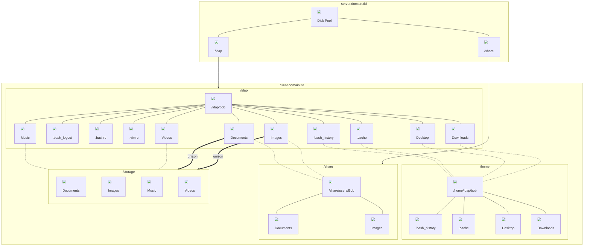

# Homesync

A simple Bash wrapper script for Unison and Inotifywait, in order to syncronize LDAP user roaming home files with the local machine for offline use; while keeping some files and folders on local storage, according to configuration.

&nbsp;

### Functionality

Consider the directory stucture below. The server `server.domain.tld` provides two NFS shares that are mounted on login via AutoFS.

- `/ldap` contains your user's roaming home directory

- `/share` contains your user's personal directories like Documents, Images, Music, Videos, etc.

- `/home/ldap` contains your user's local home directory. Here lie all files and directories that are machine-specific (e.g. `.bash_history`, `.cache`)

- `/storage` is the user's primary computer local file storage



**Note:** Dotted lines represent symbolic links.

&nbsp;

Homesync works in 2 stages:

- **Login:**
  
  1. The script will start by syncronizing `/ldap/bob` with the underlying directory that has been mounted over;
  
  2. Home directory `/ldap/bob` symbolic links will point to either `/share/users/bob` (if mounted), or the local `/storage`;
  
  3. An `inotifywait` watcher will start to monitor `create`, `delete`, `modify` and `attrib` events on `/share` to continuously sync files with `/storage`, throughout the session, with `unison`.

- **Logout:**
  
  1. Home directory `/ldap/bob` is synchronized one last time;
  
  2. All homesync processes started by the current user session are killed (SIGTERM)

&nbsp;

### Configuration

| Name                     | Type    | Description                                                                                                                                                                                                                                                                        |
| ------------------------ | ------- | ---------------------------------------------------------------------------------------------------------------------------------------------------------------------------------------------------------------------------------------------------------------------------------- |
| `DEBUG`                  | Boolean | True or false                                                                                                                                                                                                                                                                      |
| `LOG_FILE`               | String  | Where `DEBUG` will log events. By default it's `~/.log/homesync.log`                                                                                                                                                                                                               |
| `LDAP_URL`               | String  | Can be configured with an FQDN or IP address (e.g. `ldap://domain.tld`)                                                                                                                                                                                                            |
| `LDAP_DN`                | String  | Your domain's full distinguished name (e.g. `dc=domain,dc=tld`)                                                                                                                                                                                                                    |
| `LDAP_MACHINE_ATTRIBUTE` | String  | Any field in your LDAP user entry where you can define its own primary computer hostname for local storage syncronization. <br>By default it's inetOrgPerson `homePostalAddress`.                                                                                                  |
| `BIND_PATH`              | String  | Location where `/` will be bind mounted on `homesync -s` (e.g. `/mnt/bind`) <br>This is used to sync the user's roaming home with the underlying directory which has been mounted over                                                                                             |
| `UNISON_ARGS`            | String  | Space-separated list of options to use during syncs (e.g. `-batch -silent -log=false -owner -group -prefer=newer`)<br>For more options, refer to the [unison repository](https://github.com/bcpierce00/unison)                                                                     |
| `STORAGE_REMOTE`         | String  | Path of the mounted network share which contains your users' personal files (e.g. `/share/users`)                                                                                                                                                                                  |
| `STORAGE_LOCAL`          | String  | Path of the local filesystem/directory which contains the user's personal files (e.g. `/storage`) <br>This directory is synchronized with `STORAGE_REMOTE` only if the current machine that is running homesync is the user's primary computer defined in `LDAP_MACHINE_ATTRIBUTE` |
| `STORAGE_LOCAL_NAME`     | String  | Name of the symbolic link that will be created in the user's home, and point to either `STORAGE_REMOTE` or `STORAGE_LOCAL`, <br>depending on if the user is logged on with a roaming or local directory                                                                            |
| `STORAGE_DIRS_SYNC`      | String  | Space-separated list of directories to be synchronized between `STORAGE_REMOTE` and `STORAGE_LOCAL` (e.g. `Documents Images`)                                                                                                                                                      |
| `STORAGE_DIRS_NOSYNC`    | String  | Space-separated list of directories to be kept locally in `STORAGE_LOCAL` (e.g. `Music Videos`)                                                                                                                                                                                    |
| `HOME_LOCAL`             | String  | Diretory path which will store users' machine-specific files and folders (e.g. `/home/ldap`)                                                                                                                                                                                       |
| `HOME_DIRS`              | String  | Space-separated list of directories to be kept locally in HOME_LOCAL (e.g. `.cache`, `.local`, `Desktop`)                                                                                                                                                                          |
| `HOME_FILES`             | String  | Space-separated list of directories to be kept locally in HOME_LOCAL (e.g. `.bashrc`, `.bash_history`, `.viminfo`)                                                                                                                                                                 |

&nbsp;

### Usage

```bash
Usage: homesync -arg
    -a  Online: Sync roaming home with local home, and network share with local storage 
        Offline: Change symlinks to local storage 
    -d  Setup local home directory structure
    -h  Show this help message and exit
    -k  Kill all homesync processes started by the current user session
    -l  Setup home directory symlinks according to mount status
    -r  Only sync network share with local storage
    -s  Only sync roaming home with local home
```

&nbsp;

### Installation

1. Download the script and its configuration file to their destination:
   
   ```bash
   sudo wget https://raw.githubusercontent.com/RicardoJeronimo/homesync/master/homesync -O /usr/bin/homesync;
   sudo wget https://raw.githubusercontent.com/RicardoJeronimo/homesync/master/homesync.conf -O /etc/homesync.conf;
   sudo chmod +x /usr/bin/homesync
   ```

2. Setup `homesync` to run at logon (e.g. on `.profile`):
   
   ```bash
   homesync -a
   ```

3. Setup `homesync` to run at logoff (e.g. on `.bash_logout`):
   
   ```bash
   homesync -d && homesync -k
   ```
